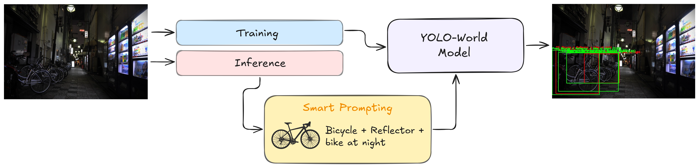
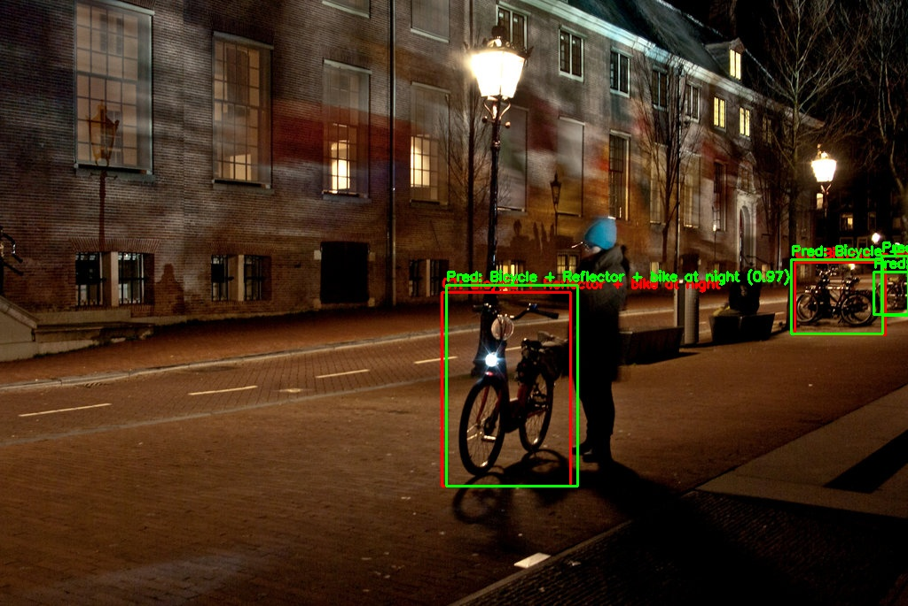

# Efficient Low-Light Object Detection via Smart Prompting with YOLO-World

> **2025 IEEE 11th International Conference on Applied System Innovation (IEEE ICASI 2025), Tokyo, Japan, 22–25 April 2025**  
> Ricky Christanto, Cheng-Yen Hsiao, Shaou-Gang Miaou

---

##  Abstract

Object detection in low-light environments is critical for surveillance, autonomous driving, and robotics applications, yet it remains challenging due to weak contrast and high noise levels. Traditional methods often rely on image enhancement techniques to address these issues, but such approaches come with high computational costs and increased latency. To overcome these limitations, we propose a novel method that leverages Smart Prompting (SP) within the YOLO-World framework, an open-vocabulary model designed to detect key object features without requiring image enhancement modules. By focusing on critical object hints, our approach reduces computational overhead while maintaining robust detection performance. Experimental evaluations on the ExDark dataset demonstrate that SP YOLO-World outperforms YOLOv8n with image enhancement regarding mean Average Precision (mAP) while achieving significantly lower latency. This balance between accuracy and efficiency makes SP YOLO-World well-suited for real-time object detection in challenging low-light scenarios. Our findings highlight the potential of smart prompting as a lightweight yet effective solution for improving object detection performance in resource-constrained environments.

---

##  Architecture Overview

The following figure illustrates the overall pipeline of our proposed method, integrating Smart Prompting into YOLO-World for efficient low-light object detection:

<p align="center">
  
</p>

---

##  Visual Comparison: w/o SP vs. w/ SP

The following figure shows the impact of Smart Prompting (SP) under challenging low-light conditions:

<p align="center">
  
  
</p>

<p align="center">
  <b>Left:</b> YOLO-World baseline &nbsp;&nbsp;&nbsp;&nbsp;|&nbsp;&nbsp;&nbsp;&nbsp; <b>Right:</b> Ours with Smart Prompting
</p>

---

##  Highlights

- 💡 **Prompt-aware detection**: Integrates semantic guidance into the object detection pipeline.
- ⚙️ **No retraining required**: Plug-and-play with existing YOLO-World weights.
- ⚡ **Lightweight and generalizable**: Improves low-light detection on diverse datasets (ExDark, LLVIP, DARK FACE).

---

##  Coming Soon

- 🔧 Code for Smart Prompting module
- 🧪 Evaluation on public datasets
- 📦 Pre-trained prompts and demo script

---

##  Citation

```bibtex
@inproceedings{hsiao2025efficient,
  title     = {Efficient Low-Light Object Detection via Smart Prompting with YOLO-World},
  author    = {Ricky Christanto and Cheng-Yen Hsiao and Shaou-Gang Miaou},
  booktitle = {2025 IEEE 11th International Conference on Applied System Innovation (IEEE ICASI)},
  address   = {Tokyo, Japan},
  pages     = {to appear},
  year      = {2025},
  month     = apr,
  publisher = {IEEE}
}

